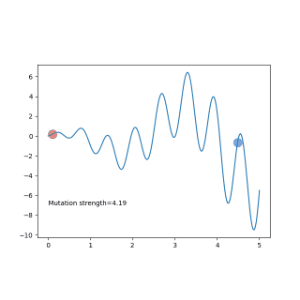

# Create a new variation of an evolutionary algorithm (try to use Deep Learning) and compare its performance with a similar algorithm already published.

This task said to do a variation of an evolutionary algorithm. 

## Basic ES
So first i search the Evolution strategy(ES) and do a basic implement use the ES, in [Basic.py](Ecolution_Strategy/Basic.py).

Evolution Strategies (ES) is one type of black-box optimization algorithms, born in the family of Evolutionary Algorithms (EA). Evolution strategies (ES) belong to the big family of evolutionary algorithms. The optimization targets of ES are vectors of real numbers, $x\in R^n$.

Evolutionary algorithms refer to a division of population-based optimization algorithms inspired by natural selection. Natural selection believes that individuals with traits beneficial to their survival can live through generations and pass down the good characteristics to the next generation. Evolution happens by the selection process gradually and the population grows better adapted to the environment.

Evolutionary algorithms can be summarized in the following format as a general optimization solution:
Let’s say we want to optimize a function f(x) and we are not able to compute gradients directly. But we still can evaluate f(x) given any x and the result is deterministic. Our belief in the probability distribution over x as a good solution to f(x) optimization is pθ(x), parameterized by θ. The goal is to find an optimal configuration of $θ$.

Starting with an initial value of θ, we can continuously update θ by looping three steps as follows:
1. Generate a population of samples D={(xi,f(xi)} where xi∼pθ(x).
2. Evaluate the “fitness” of samples in D.
3. Select the best subset of individuals and use them to update θ, generally based on fitness or rank.
4. 
In Genetic Algorithms (GA), another popular subcategory of EA, x is a sequence of binary codes, $x\in{0,1}^n$. While in ES, x is just a vector of real numbers, $x\in R^n$.

$$
(\mu/\rho + or , \lambda)
$$
Here $\mu$ is the number of population, and $\rho$ is the number selected from the population to generate babies. $\lambda$ is the number of babies generated. 
If the form of $+$ is used, it is to use a mixture of $ρ + λ$ to make the fittest Survival, if it is$,$ form, then just use $λ$ for survival of the fittest.

The target is that to find the highest point in this picture.


The first make_kid function. We randomly find a pair of parents, and then crossover the parents' DNA and mut_strength gene to kid. Then according to mut_strength mutate the kid's DNA. That is, use a normal distribution to sample a DNA sample. And mut_strength can also Mutation. After mutating the intensity of the variation, he can consciously gradually reduce the intensity of the variation when it is about to converge, so as to facilitate the convergence.
```
def make_kid(pop, n_kid):
    # generate empty kid holder 
    kids = {'DNA': np.empty((n_kid, DNA_SIZE))}
    kids['mut_strength'] = np.empty_like(kids['DNA'])
    for kv, ks in zip(kids['DNA'], kids['mut_strength']):
        # crossover (roughly half p1 and half p2)
        p1, p2 = np.random.choice(np.arange(POP_SIZE), size=2, replace=False)
        cp = np.random.randint(0, 2, DNA_SIZE, dtype=np.bool) # crossover points 
        
        kv[cp] = pop['DNA'][p1, cp] # true 
        kv[~cp] = pop['DNA'][p2, ~cp] # false 
        ks[cp] = pop['mut_strength'][p1, cp]
        ks[~cp] = pop['mut_strength'][p2, ~cp]

        # mutate (change DNA based on normal distribution)
        ks[:] = np.maximum(ks + (np.random.rand(*ks.shape)-0.5), 0.) # must > 0 
        kv += ks * np.random.randn(*kv.shape)
        kv[:] = np.clip(kv, *DNA_BOUND) # clip the mutate value 
    return kids 
```
Then comes the thrilling killing time. According to fitness, choose some people with the highest fitness, and discard those with poor fitness. This is very simple.
```
def kill_bad(pop, kids):
    global MUT_STRENGTH
    # put pop and kids together
    for key in ['DNA', 'mut_strength']:
        pop[key] = np.vstack((pop[key], kids[key]))

    fitness = get_fitness(F(pop['DNA'])) # calculate global fitness
    idx = np.arange(pop['DNA'].shape[0])
    good_idx = idx[fitness.argsort()][-POP_SIZE:] # selected by fitness ranking (not value)
    # idx里后100个数
    
    for key in ['DNA', 'mut_strength']:
        pop[key] = pop[key][good_idx]
    return pop
```
In this way, we have completed the main body of the most general ES algorithm.
The result is below:


## (1+1) ES
And then, i do a variation of the ES, use one parent and one kid instead of basic ES, in [(1+1)_ES.py](Ecolution_Strategy/(1+1)_ES.py).

As you can see above, in general, 
$$(μ/ρ +, λ)-ES$$ (1+1)-ES is just a special form. Here μ is the number of population, and ρ is selected from population The number, used to generate babies. λ is the number of babies that are generated. If the + form is used, it is used to mix ρ + λ for survival of the fittest. If it is, the form, then only λ is used for the fittest survive.

What we consider is just a father, generate a baby, and then play the survival of the fittest game between the father and the baby, and choose the better of the father and the baby as the next generation father. 

(1+1) ES summarizes as follows:
1. Have one dad;
2. A baby was mutated according to the father;
3. The one chosen among fathers and babies becomes the next generation of fathers.

Same as the previous section, this time we still have two functions, make_kid and kill_bad.
So all operations have only one number of pops. At this time, our strategy in (1+1)-ES is that only the average value is stored in the parent DNA, and there is no variation intensity (standard deviation). This time the variation intensity MUT_STRENGTH is one global variable. A scalar means it is fine.
```
def make_kid(parent):
    # no crossover, only mutation 
    k = parent + MUT_STRENGTH * np.random.randn(DNA_SIZE)
    k = np.clip(k, *DNA_BOUND)
    return k
```
In kill_bad, we choose the more suitable one, whether it is a father or a child, as long as it is suitable, we will stay, and the one that is not suitable will be killed. However, we should also pay attention to this step. We have to change MUT_STRENGTH a little bit. The method of change follows the 1/5 successful rule. This method was proposed by the founder of ES. 
```
def kill_bad(parent, kid):
    # to change the mut_strength
    global MUT_STRENGTH
    fp = get_fitness(F(parent))[0]
    fk = get_fitness(F(kid))[0]
    p_target = 1/5

    if fp < fk: # kid better than parent 
        parent = kid
        ps = 1. # kid win > ps = 1 (successful offspring)
    else:
        ps = 0
    # adjust global mutation strength 
    MUT_STRENGTH *= np.exp(1/np.sqrt(DNA_SIZE+1) * (ps - p_target)/(1 - p_target))

    return parent
```
The result is below:


# NEAT
And then, i have a look at [3]. This paper invent a NEAT algorithm.NEAT is a typical genetic algorithm. And i also look this condensed version on conference [6] is also Good reading material.

Simply, NEAT has several key steps,

1. Direct coding of neural networks using Innovation ID Cross-matching 
2. (crossover) based on innovation ID
3. Gene mutations on neurons (node) and neural links (link)
4. Try to preserve biodiversity (Speciation) (some bad networks may suddenly mutate into super powerful ones)
5. Minimize the size of the neural network by initializing the neural network with only input connected to output (starting from the smallest neural network structure)


In the above figure, you can imagine the achievement is how we compile a neural network through DNA (Genome in the figure). 
**Node genes** are simply the definition of each node of the neural network. Which are the inputs, which outputs, and which are hidden nodes. 
**Connect. Genes** is the form of the link between each node and the node, from the input node (In) to the output node (Out), what is the parameter (weight) of the link. The value of the output node is **Out = In * weight**. 
Then whether this link is to be used (Enabled) or not (DISAB). 
The last is the unique innovation number (Innov) of this link.

Through the Genome above, we can build the neural network. It can be seen that we have a 2-5 DISAB link. The reason is that we have mutated a 4-node between 2-5. So 2-5 is passed 4-phase link, so we need to disable the original 2-5 link.


Regarding mutation. We can have **node mutation** and **link mutation**, just like the picture above. 
This is simple and everyone can see. But one thing to mention is that if the newly added node is like 6, it is on the original link Mutation node, then the original 3-5 link will be disabled.


Then there is the **crossover**, the two neural networks are mating. 
At this time, you will find that the innovation number is so important here. The two parents are aligned by the innovation number, and both of them have the innovation, we will choose one at random, if both sides have one that don's have the innovation,we will pass it all directly to the offspring.

The reason why the genes of **disjoint** and **excess** appear on the graph is because if we want to distinguish the difference of the population and choose the population to be retained later, we need to use this to calculate. 

Well, through the above method step by step, the good neural network is retained, and the bad one is killed. The neural network can evolve toward the correct square.

> The figure above are from [6]

Then i find a libary named neat-python, like [4].
NEAT-Python is a pure Python implementation of NEAT, with no dependencies other than the Python standard library.

The [evolve-minimal.py](NEAT/evolve-minimal.py) example, shown in its entirety at the bottom of this page, evolves a network that implements the two-input XOR function:
| Input 1 | Input 2 | Output |
| --- | --- | ---|
|0 | 0 | 0 |
| 0 | 1 | 1 |
| 1 | 0 | 1 |
| 1 | 1 | 0 |
The result is below:
```
 ****** Running generation 129 ******

Population's average fitness: 2.38880 stdev: 0.52937
Best fitness: 3.49969 - size: (4, 7) - species 7 - id 13838
Average adjusted fitness: 0.561
Mean genetic distance 2.948, standard deviation 1.124
Population of 149 members in 11 species
Total extinctions: 0
Generation time: 0.024 sec (0.025 average)

 ****** Running generation 130 ******

Population's average fitness: 2.41928 stdev: 0.46967
Best fitness: 3.49969 - size: (4, 7) - species 7 - id 13838
Average adjusted fitness: 0.288
Mean genetic distance 2.801, standard deviation 1.000
Population of 152 members in 11 species
Total extinctions: 0
Generation time: 0.026 sec (0.025 average)

 ****** Running generation 131 ******

Population's average fitness: 2.42385 stdev: 0.47254
Best fitness: 3.49969 - size: (4, 7) - species 7 - id 13838
Average adjusted fitness: 0.392
Mean genetic distance 2.841, standard deviation 1.037
Population of 153 members in 11 species
Total extinctions: 0
Generation time: 0.026 sec (0.026 average)

 ****** Running generation 132 ******

Population's average fitness: 2.39058 stdev: 0.50662
Best fitness: 3.97884 - size: (4, 6) - species 18 - id 18485

Best individual in generation 132 meets fitness threshold - complexity: (4, 6)

Best genome:
Key: 18485
Fitness: 3.978838349644304
Nodes:
        0 DefaultNodeGene(key=0, bias=-0.74070723976249, response=1.0, activation=sigmoid, aggregation=sum)
        3021 DefaultNodeGene(key=3021, bias=0.3659797145692682, response=1.0, activation=sigmoid, aggregation=sum)
        3510 DefaultNodeGene(key=3510, bias=-1.2625110259139902, response=1.0, activation=sigmoid, aggregation=sum)
        3740 DefaultNodeGene(key=3740, bias=-1.655470794345129, response=1.0, activation=sigmoid, aggregation=sum)
Connections:
        DefaultConnectionGene(key=(-2, 0), weight=-1.8948000667389844, enabled=False)
        DefaultConnectionGene(key=(-2, 3510), weight=1.5790297618899929, enabled=True)
        DefaultConnectionGene(key=(-2, 3740), weight=1.8365859353347043, enabled=True)
        DefaultConnectionGene(key=(-1, 0), weight=1.726424943554256, enabled=True)
        DefaultConnectionGene(key=(-1, 3510), weight=-0.9143899764788945, enabled=True)
        DefaultConnectionGene(key=(3510, 0), weight=8.267603818596386, enabled=True)
        DefaultConnectionGene(key=(3740, 0), weight=-2.4434315033546277, enabled=True)

Output:
  input (0.0, 0.0), expected output (0.0,), got [0.02578561270750239]
  input (0.0, 1.0), expected output (1.0,), got [0.9999999996884756]
  input (1.0, 0.0), expected output (1.0,), got [0.9927986439889035]
  input (1.0, 1.0), expected output (0.0,), got [0.14298563915511228]
```

## Reference
1. [Evolution strategy](https://en.wikipedia.org/wiki/Evolution_strategy)
2. Salimans T, Ho J, Chen X, et al. Evolution strategies as a scalable alternative to reinforcement learning[J]. arXiv preprint arXiv:1703.03864, 2017.
3. K. O. Stanley and R. Miikkulainen, "Evolving Neural Networks through Augmenting Topologies," in Evolutionary Computation, vol. 10, no. 2, pp. 99-127, June 2002, doi: 10.1162/106365602320169811.
4. [Overview of the basic XOR example ](https://neat-python.readthedocs.io/en/latest/xor_example.html#)
5. [Neuroevolution of augmenting topologies(wikipad)](https://en.wikipedia.org/wiki/Neuroevolution_of_augmenting_topologies)
6. In William B. Langdon and Erick Cantu-Paz and Keith E. Mathias and Rajkumar Roy and David Davis and Riccardo Poli and Karthik Balakrishnan and Vasant Honavar and G{"u}nter Rudolph and Joachim Wegener and Larry Bull and Mitchell A. Potter and Alan C. Schultz, editors, Proceedings of the Genetic and Evolutionary Computation Conference, 1757-1762, Piscataway, NJ, 2002. San Francisco, CA: Morgan Kaufmann.