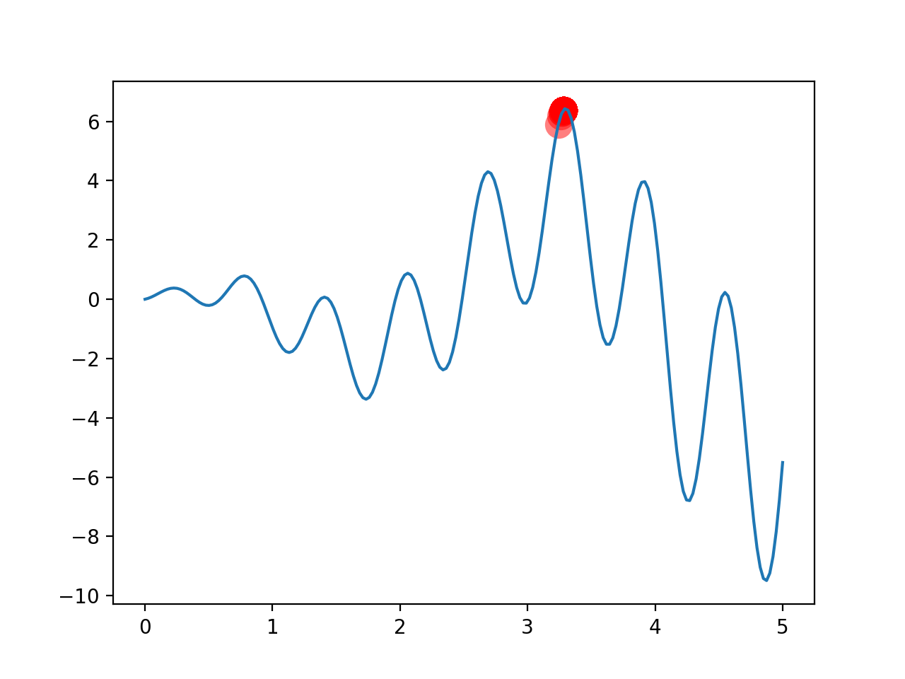

# Create a new variation of an evolutionary algorithm (try to use Deep Learning) and compare its performance with a similar algorithm already published.

This task said to do a variation of an evolutionary algorithm. 

## Basic EC
So first i search the Evolution strategy(ES) and do a basic implement use the ES, in [Basic.py](Ecolution_Strategy/Basic.py).

$$
(\mu/\rho + or , \lambda)
$$
Here $\mu$ is the number of population, and $\rho$ is the number selected from the population to generate babies. $\lambda$ is the number of babies generated. 
If the form of $+$ is used, it is to use a mixture of $ρ + λ$ to make the fittest Survival, if it is$,$ form, then just use $λ$ for survival of the fittest.

The target is that to find the highest point in this picture.

## (1+1) EC
And then, i do a variation of the ES, use one parent and one kid instead of basic ES, in [(1+1)_ES.py](Ecolution_Strategy/(1+1)_ES.py).

What we consider is just a father, generate a baby, and then play the survival of the fittest game between the father and the baby, and choose the better of the father and the baby as the next generation father. 

(1+1) ES summarizes as follows:
1. Have one dad;
2. A baby was mutated according to the father;
3. The one chosen among fathers and babies becomes the next generation of fathers.

# NEAT
And then, i have a look at [3]. This paper invent a NEAT algorithm.NEAT is a typical genetic algorithm. And i also look this condensed version on conference [6] is also Good reading material.

Simply, NEAT has several key steps,

1. Direct coding of neural networks using Innovation ID Cross-matching 
2. (crossover) based on innovation ID
3. Gene mutations on neurons (node) and neural links (link)
4. Try to preserve biodiversity (Speciation) (some bad networks may suddenly mutate into super powerful ones)
5. Minimize the size of the neural network by initializing the neural network with only input connected to output (starting from the smallest neural network structure)

In the above figure, you can imagine the achievement is how we compile a neural network through DNA (Genome in the figure). 
**Node genes** are simply the definition of each node of the neural network. Which are the inputs, which outputs, and which are hidden nodes. 
**Connect. Genes** is the form of the link between each node and the node, from the input node (In) to the output node (Out), what is the parameter (weight) of the link. The value of the output node is **Out = In * weight**. 
Then whether this link is to be used (Enabled) or not (DISAB). 
The last is the unique innovation number (Innov) of this link.

Through the Genome above, we can build the neural network. It can be seen that we have a 2-5 DISAB link. The reason is that we have mutated a 4-node between 2-5. So 2-5 is passed 4-phase link, so we need to disable the original 2-5 link.

Regarding mutation. We can have **node mutation** and **link mutation**, just like the picture above. 
This is simple and everyone can see. But one thing to mention is that if the newly added node is like 6, it is on the original link Mutation node, then the original 3-5 link will be disabled.

Then there is the **crossover**, the two neural networks are mating. 
At this time, you will find that the innovation number is so important here. The two parents are aligned by the innovation number, and both of them have the innovation, we will choose one at random, if both sides have one that don's have the innovation,we will pass it all directly to the offspring.

The reason why the genes of **disjoint** and **excess** appear on the graph is because if we want to distinguish the difference of the population and choose the population to be retained later, we need to use this to calculate. 

Well, through the above method step by step, the good neural network is retained, and the bad one is killed. The neural network can evolve toward the correct square.

> The figure above are from [6]

Then i find a libary named neat-python, like [4].
NEAT-Python is a pure Python implementation of NEAT, with no dependencies other than the Python standard library.

The [evolve-minimal.py](NEAT/evolve-minimal.py) example, shown in its entirety at the bottom of this page, evolves a network that implements the two-input XOR function:
| Input 1 | Input 2 | Output |
| --- | --- | ---|
|0 | 0 | 0 |
| 0 | 1 | 1 |
| 1 | 0 | 1 |
| 1 | 1 | 0 |

## Reference
1. [Evolution strategy](https://en.wikipedia.org/wiki/Evolution_strategy)
2. Salimans T, Ho J, Chen X, et al. Evolution strategies as a scalable alternative to reinforcement learning[J]. arXiv preprint arXiv:1703.03864, 2017.
3. K. O. Stanley and R. Miikkulainen, "Evolving Neural Networks through Augmenting Topologies," in Evolutionary Computation, vol. 10, no. 2, pp. 99-127, June 2002, doi: 10.1162/106365602320169811.
4. [Overview of the basic XOR example ](https://neat-python.readthedocs.io/en/latest/xor_example.html#)
5. [Neuroevolution of augmenting topologies(wikipad)](https://en.wikipedia.org/wiki/Neuroevolution_of_augmenting_topologies)
6. In William B. Langdon and Erick Cantu-Paz and Keith E. Mathias and Rajkumar Roy and David Davis and Riccardo Poli and Karthik Balakrishnan and Vasant Honavar and G{"u}nter Rudolph and Joachim Wegener and Larry Bull and Mitchell A. Potter and Alan C. Schultz, editors, Proceedings of the Genetic and Evolutionary Computation Conference, 1757-1762, Piscataway, NJ, 2002. San Francisco, CA: Morgan Kaufmann.