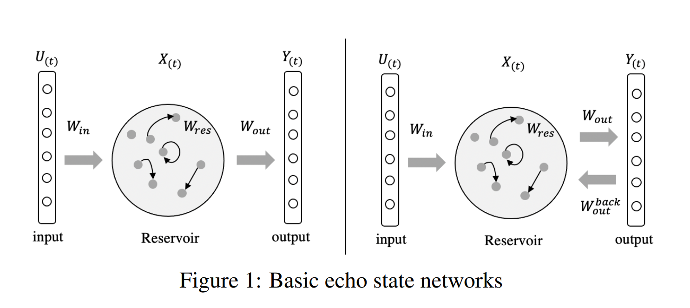

# Create a reservoir network to solve a given task. Make slight changes to it to improve its performance on the same tests.
This task need to create a reservoir netowrk. 

I do some research, and i know about Reservoir computing, is a framework for computation derived from recurrent neural network theory that maps input signals into higher dimensional computational spaces through the dynamics of a fixed, non-linear system called a reservoir.

And then i know that, Echo state network is a type of reservoir computing. 

First. I have a look at [4], this paper have a summary about the Echo state networks. And then i konw that there is a type of combation with deep learning and Echo state networks, called DeepESN, the paper is [3].

And then i found that, the [6] have a simple example, use the Echo state networkd to do a prediction.

So in this task, I decide to use the Echo state network(ESN) in the MackeyGlass to do a predictive.

## Echo state network
Echo state networks (ESN) provide an architecture and supervised learning principle for recurrent neural networks (RNNs). The main idea is (i) to drive a random, large, fixed recurrent neural network with the input signal, thereby inducing in each neuron within this "reservoir" network a nonlinear response signal, and (ii) combine a desired output signal by a trainable linear combination of all of these response signals.

It is also composed of , input layer, hidden layer, and output layer. 
It designs the hidden layer as a sparse network composed of many neurons, and achieves the function of memorizing data by adjusting the characteristics of the internal weight of the network.
Its internal dynamic reserve pool (DR) contains a large number of sparsely connected neurons, contains the operating state of the system, and has a short-term training memory function.
The process of ESN training is the process of training the connection weight (Wout) from the hidden layer to the output layer.

The connection from the input layer to the reserve pool is $Win (N*K)$, and the connection from the reserve pool to the next time the reserve pool state is $W (N*N)$. The connection from the pool to the output layer is $Wout (L*(K+N+L))$. 
In addition, there is a connection $Wback (N*L)$ from the output layer at the previous moment to the reserve pool at the next moment. This connection is not necessary.

Every time u(t) is input, the state of the reserve pool must be updated, and its state update equation is:
$$
x(t+1) = f(W_{in} * u(t+1) + W_{back}x(t))
$$

Both $Win$ and $Wback$ are randomly initialized when the network is initially established, and are fixed. 
$u(t+1)$ is the input at this moment, $x(t+1)$ is the state of the reserve pool at this moment, and $x(t)$ is the state of the reserve pool at the last moment can be initialized with 0 at t=0. 
$f$ is the internal neuron activation function of DR, and the hyperbolic tangent function (tanh) is usually used.

$x$ is a vector of length N.

The output state equation of ESN is:
$$
y(t+1) = f_{out} * (W_{out} * (u(t+1), x(t+1)))
$$
$fout$ is the neuron activation function of the output layer.

Now that we have the state of the reserve pool, and with the ESN output method, $Wout$ can be determined according to the target output $y(target)$, so that the loss between $y(t+1)$ and $y(target)$ is as small as possible. This is a simple linear regression problem.

## Reservior
The reserve pool is the core structure of the network. 
The reserve pool is a recursive structure of randomly generated, large-scale, sparse connections (SD usually maintains 1%-5% connections).

The final performance of the ESN is determined by the various parameters of the reserve pool, including: the internal connection weight spectrum radius SR of the reserve pool, the reserve pool size N, the reserve pool input unit scale IS, and the reserve pool sparseness SD.
1. The internal connection weight spectrum radius SR of the reserve pool.
It is the eigenvalue with the largest absolute value of the connection weight matrix $W$, denoted as $λmax$, $λmax<1$ is a necessary condition to ensure the stability of the network

    $\lambda_{max}=max(abs(W))$

2. The size of the reserve pool N. 
It is the number of neurons in the reserve pool. The size of the reserve pool is related to the number of samples, which has a great impact on network performance. The larger the reserve pool size, the more accurate the ESN description of a given dynamic system will be Overfitting problem.
3. The storage tank input unit scale IS. 
   It is a scale factor that needs to be multiplied before the input signal of the reserve pool is connected to the neurons in the reserve pool, that is, the input signal is scaled to a certain extent. Generally, the stronger the nonlinearity of the object to be processed, the larger the IS.
4. The sparseness of the reserve pool SD. 
   It represents the connection between neurons in the reserve pool, and not all neurons in the reserve pool have connections. SD represents the percentage of the total number of interconnected neurons in the reserve pool to the total neuron N. The larger the value, the stronger the nonlinear approximation ability.

## Reference 
1. [Reservoir computing(wikipad)](https://en.wikipedia.org/wiki/Reservoir_computing)
2. Schaetti, N., Salomon, M., & Couturier, R. (2016). Echo State Networks-Based Reservoir Computing for MNIST Handwritten Digits Recognition. 2016 IEEE Intl Conference on Computational Science and Engineering (CSE) and IEEE Intl Conference on Embedded and Ubiquitous Computing (EUC) and 15th Intl Symposium on Distributed Computing and Applications for Business Engineering (DCABES), 484-491.
3. Gallicchio C, Micheli A. Deep echo state network (deepesn): A brief survey[J]. arXiv preprint arXiv:1712.04323, 2017.
4. Sun C, Song M, Hong S, et al. A Review of Designs and Applications of Echo State Networks[J]. arXiv preprint arXiv:2012.02974, 2020.
5. [Echo state network](http://www.scholarpedia.org/article/Echo_state_network)
6. [回声状态网络(ESN)原理详解(附源码实现)](https://blog.csdn.net/zwqhehe/article/details/77025035)