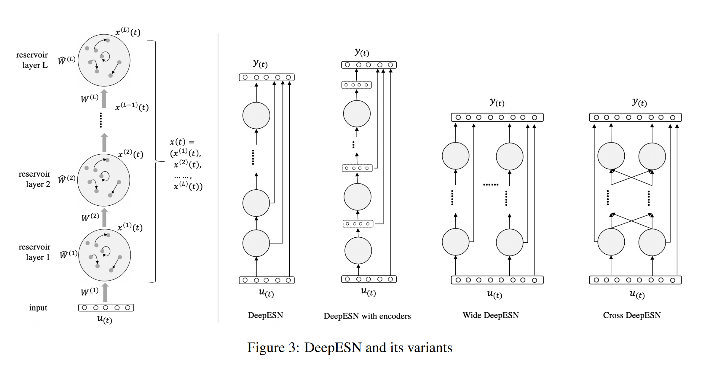

# Create a reservoir network to solve a given task. Make slight changes to it to improve its performance on the same tests.
This task need to create a reservoir netowrk. 

I do some research, and i know about Reservoir computing, is a framework for computation derived from recurrent neural network theory that maps input signals into higher dimensional computational spaces through the dynamics of a fixed, non-linear system called a reservoir.

And then i know that, Echo state network is a type of reservoir computing. 

First. I have a look at [4], this paper have a summary about the Echo state networks. And then i konw that there is a type of combation with deep learning and Echo state networks, called DeepESN, the paper is [3].

Echo state networks (ESN) provide an architecture and supervised learning principle for recurrent neural networks (RNNs). The main idea is (i) to drive a random, large, fixed recurrent neural network with the input signal, thereby inducing in each neuron within this "reservoir" network a nonlinear response signal, and (ii) combine a desired output signal by a trainable linear combination of all of these response signals.

And then i found that, the [2] use the Echo state networkd in the MNIST to do a object recogniton. 

So in this task, I decide to use the Deep Echo state network(ESN) in the MNIST to do a object recognition.

## Echo state network

## Deep Echo state network

## Reference 
1. [Reservoir computing(wikipad)](https://en.wikipedia.org/wiki/Reservoir_computing)
2. Schaetti, N., Salomon, M., & Couturier, R. (2016). Echo State Networks-Based Reservoir Computing for MNIST Handwritten Digits Recognition. 2016 IEEE Intl Conference on Computational Science and Engineering (CSE) and IEEE Intl Conference on Embedded and Ubiquitous Computing (EUC) and 15th Intl Symposium on Distributed Computing and Applications for Business Engineering (DCABES), 484-491.
3. Gallicchio C, Micheli A. Deep echo state network (deepesn): A brief survey[J]. arXiv preprint arXiv:1712.04323, 2017.
4. Sun C, Song M, Hong S, et al. A Review of Designs and Applications of Echo State Networks[J]. arXiv preprint arXiv:2012.02974, 2020.
5. [Echo state network](http://www.scholarpedia.org/article/Echo_state_network)