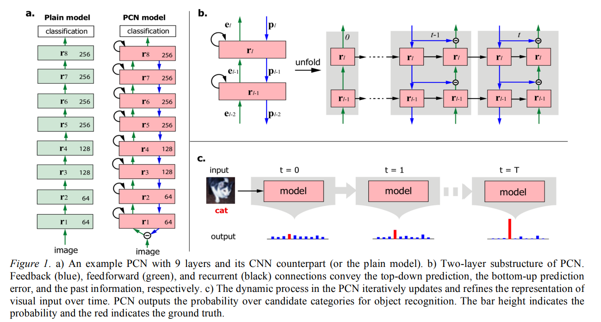
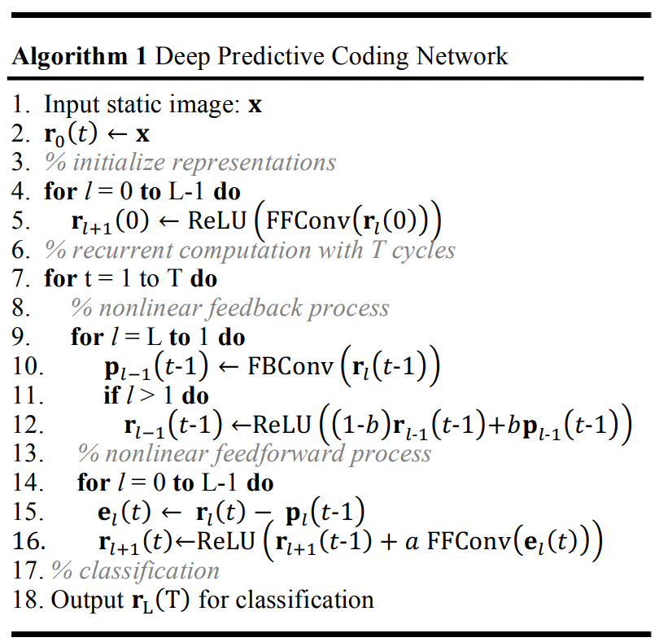

# Review briefly predictive encoding and create a predictive encoding model on CIFAR10 and attack it to verify its robustness.
This task said to create a predictive encoding model on CIFAR10, and attack it to verify its robustness. 

So first, i saw this url, [a-new-kind-of-deep-neural-networks](https://towardsdatascience.com/a-new-kind-of-deep-neural-networks-749bcde19108).
Then i know that, [PredNet](https://coxlab.github.io/prednet/) is a deep convolutional recurrent neural network inspired by the principles of predictive coding.
But it is trained for next-frame video prediction not the image. 
And then i find a paper named [1], they propose a predictive coding networks(PCN) for Object Recognition.
The PCN is used for object recogntion, so i have a implement with it on CIFAR10.

The network structure is like the next figure. 

So this network have 9 layers, like a.
b is Two-layer substructure of PCN.Feedback (blue), feedforward (green), and recurrent (black) connections convey the top-down prediction, the bottom-up prediction error, and the past information, respectively.

The next is the Algorithm for the PCN network.

These figure from [1].

And then, like task B3, i use the adversarial attack to verify its robustness. 
The training log is saved in ./log folder, and the adversarial attack result is saved in the same folder. 

I train the PCN in 250 epochs, and adversarial attack epsilons in [0, .05, .1, .15, .2, .25, .3, .5, 1.]

## Reference 
1. Wen H, Han K, Shi J, et al. Deep predictive coding network for object recognition[C]//International Conference on Machine Learning. PMLR, 2018: 5266-5275.