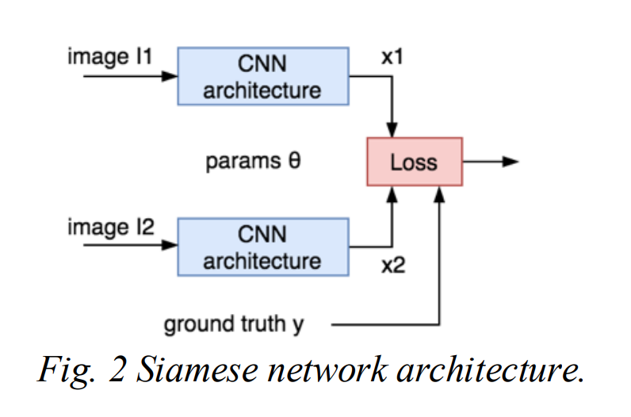

# Train a neural network to calculate the similarity between images in CIFAR, MNIST or both. 
So this task is about calculate the similarity between images. 

First, i think about the Frechet Inception Distance score(FID).

The FID is a metric that calculates the distance between feature vectors calculated for real and generated images.

The score summarizes how similar the two groups are in terms of statistics on computer vision features of the raw images calculated using the inception v3 model used for image classification. Lower scores indicate the two groups of images are more similar, or have more similar statistics, with a perfect score being 0.0 indicating that the two groups of images are identical.

The FID score is used to evaluate the quality of images generated by generative adversarial networks, and lower scores have been shown to correlate well with higher quality images.

But this method compares the raw iamges with the generated images, i don't konw if it match this task. 

---
Then I investigated on the Internet and found a way to compare the similarity of two pictures.

It's called **Siamese neural network**.
The Siamese neural network is an artificial neural network that uses the same weights while working in tandem on two different input vectors to compute comparable output vectors.

## Reference
1. Appalaraju S, Chaoji V. Image similarity using deep CNN and curriculum learning[J]. arXiv preprint arXiv:1709.08761, 2017.