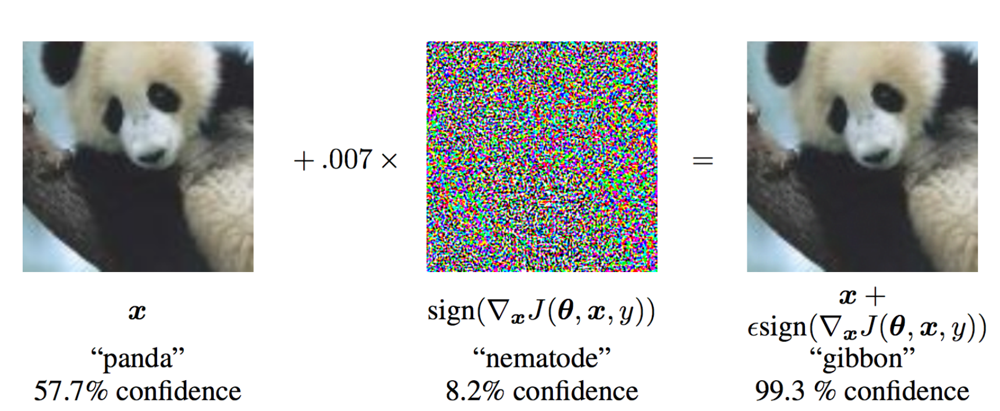

# Apply a single deep learning network to CIFAR, MNIST or both and then modify the dataset to one in which the network perform statistically worse than before. 

this task is talk about modify the datset to fool the network.
so first i think it's a image enhancement task, for example, rotate, crop, and stretch the image.
but as i konw, image enhancement is always used when the dataset is insufficient, and to increase the richness of the dataset when training the network.

I think the use of image enhancement should not meet the requirements of this taskt.
Then I searched the Internet for content related to image fooling, and i first have a look at 

Use pytorch to implement Fooling Images (add specific noise to the original image to make the neural network misrecognize)
https://www.programmersought.com/article/40155926731/

I think this should be a bit close to the task, but there are still some strange things. At this time I learned about a technology called adversarial attack.  
so the Adversarial attack is a machine learning technique that attempts to fool models by supplying deceptive input.

I think this fits the task, but i have never been exposed to this technology, I did a lot of searches.  
This time i found that in pytorch homepage, it have a tutorial about adversarial example generation.

ADVERSARIAL EXAMPLE GENERATION
https://pytorch.org/tutorials/beginner/fgsm_tutorial.html

I think this is in line with this task, so I studied the tutorial.

In this tutorial, they introduce the Fast Gradient Sign Attack (FGSM).  
It is a white-box attack with the goal of misclassification.
And i also have a look at the paper named,   

"Explaining and Harnessing Adversarial Examples"
https://arxiv.org/pdf/1412.6572.pdf

so in a word, from the figure, $\mathbf{x}$ is the original input image correctly classified as a “panda”, $y$ is the ground truth label for $\mathbf{x}$, $\mathbf{\theta}$ represents the model parameters, and $J(\mathbf{\theta}, \mathbf{x}, y)$ is the loss that is used to train the network. 

The attack backpropagates the gradient back to the input data to calculate $\nabla_{x} J(\mathbf{\theta}, \mathbf{x}, y)$.

Then, it adjusts the input data by a small step ($\epsilon$ or 0.007 in the picture) in the direction (i.e. $sign(\nabla_{x} J(\mathbf{\theta}, \mathbf{x}, y))$ that will maximize the loss. 

The resulting perturbed image, $x'$, is then misclassified by the target network as a “gibbon” when it is still learly a “panda”.

## FGSM Attack
They define the function that creates the adversarial examples by perturbing the original inputs. The fgsm_attack function takes three inputs, 

- image is the original clean image (x),   
- epsilon is the pixel-wise perturbation amount ($\epsilon$),   
- data_grad is gradient of the loss w.r.t the input image ($\nabla_{x} J(\mathbf{\theta}, \mathbf{x}, y))$. 

The function then creates perturbed image as:

## Reference 
1. Goodfellow I J, Shlens J, Szegedy C. Explaining and harnessing adversarial examples[J]. arXiv preprint arXiv:1412.6572, 2014.
2. [ADVERSARIAL EXAMPLE GENERATION](https://pytorch.org/tutorials/beginner/fgsm_tutorial.html#fast-gradient-sign-attack)
