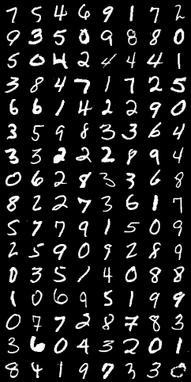
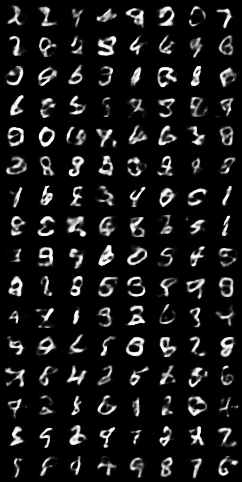

# Reconstruct images from CIFAR, MNIST or both from noisy images. 
This task requires reconstruct images from noise images.
So the first thing I think of is GANs.

The GAN is that put two neural networks contest with each other in a game (in the form of a zero-sum game, where one agent's gain is another agent's loss).
And the input of Generator is a noize, so i think the GAN can do well result in this task. 
But the noise input to Generator is randomly obtained data from the standard normal distribution, and has nothing relation with noisy images or orignal images.

Then I thought of Variational autoencoder(VAE).  
The aim of an autoencoder is to learn a representation (encoding) for a set of data, typically for dimensionality reduction, by training the network to ignore signal “noise”.

so, from images get noisy, and from noisy get generated images. 
i think VAE can have a good result in this task.

## Introduction 
“Generative modeling” is a broad area of machine learning which deals with models of distributions $P(X)$, defined over datapoints $X$ in some potentially high-dimensional space $X$. 

For instance, images are a popular kind of data for which we might create generative models. Each “datapoint” (image) has thousands or millions of dimensions (pixels), and the generative model’s job is to somehow capture the  dependencies between pixels, e.g., that nearby pixels have similar color, and are organized into objects.
Exactly what it means to “capture” these dependencies depends on exactly what we want to do with the model. One straightforward kind of generative model simply allows us to compute $P(X)$ numerically. 
In the case of images, $X$ values which look like real images should get high probability, whereas images that look like random noise should get low probability. 

However, models like this are not necessarily useful: knowing that one image is unlikely does not help us synthesize one that is likely.

Instead, one often cares about producing more examples that are like those already in a database, but not exactly the same. We could start with a
database of raw images and synthesize new, unseen images. 
We might take in a database of 3D models of something like plants and produce more of them to fill a forest in a video game. We could take handwritten text and try to produce more handwritten text. Tools like this might actually be useful for graphic designers. 
We can formalize this setup by saying that we get examples $X$ distributed according to some unknown distribution $P_{gt}(X)$, and our goal is to learn a model $P$ which we can sample from, such that $P$ is as similar as possible to $P_{gt}$.

Training this type of model has been a long-standing problem in the machine learning community, and classically, most approaches have had one of three serious drawbacks. 
- First, they might require strong assumptions about the structure in the data. 
- Second, they might make severe approximations, leading to sub-optimal models. 
- Third, they might rely on computationally expensive inference procedures like Markov Chain Monte Carlo. 

More recently, some works have made tremendous progress in training neural
networks as powerful function approximators through backpropagation. These advances have given rise to promising frameworks which can use backpropagation-based function approximators to build generative models. One of the most popular such frameworks is the **Variational Autoencoder**.

In just three years, Variational Autoencoders (VAEs) have emerged as one of the most popular approaches to unsupervised learning of complicated distributions. VAEs are appealing because they are built on top of standard function approximators (neural networks), and can be trained with stochastic gradient descent.
VAEs have already shown promise in generating many kinds of complicated data, including handwritten digits, faces, house numbers, CIFAR images, physical models of scenes, segmentation, and predicting the future from static images. 

In this task, i just use the mlp to reconstruct the images from MNIST. But if want to have a better performance, it should use cnn instead of mlp.

## Dimensionality reduction, principal component analysis(PCA) and autoencoders
### dimensionality reduction
In machine learning, dimensionality reduction is the process of reducing the number of features that describe some data. This reduction is done either by selection (only some existing features are conserved) or by extraction (a reduced number of new features are created based on the old features) and can be useful in many situations that require low dimensional data (data visualisation, data storage, heavy computation…). 
Although there exists many different methods of dimensionality reduction, we can set a global framework that is matched by most of these methods.

First, let’s call encoder the process that produce the “new features” representation from the “old features” representation (by selection or by extraction) and decoder the reverse process. 
Dimensionality reduction can then be interpreted as data compression where the encoder compress the data (from the initial space to the encoded space, also called latent space) whereas the decoder decompress them. Of course, depending on the initial data distribution, the latent space dimension and the encoder definition, this compression can be lossy, meaning that a part of the information is lost during the encoding process and cannot be recovered when decoding.

The main purpose of a dimensionality reduction method is to find the best encoder/decoder pair among a given family. In other words, for a given set of possible encoders and decoders, we are looking for the pair that keeps the maximum of information when encoding and, so, has the minimum of reconstruction error when decoding. If we denote respectively E and D the families of encoders and decoders we are considering, then the dimensionality reduction problem can be written
$$
(e^*, d^*) = \argmin _{(e,d) \in E * D} \epsilon(x, d(e(x)))
$$
where, $\epsilon(x, d(e(x))) $defines the reconstruction error measure between the input data x and the encoded-decoded data d(e(x)). 
Notice finally that in the following we will denote $N$ the number of data, $n_d$ the dimension of the initial (decoded) space and $n_e$ the dimension of the reduced (encoded) space.

### Principal components analysis (PCA)
One of the first methods that come in mind when speaking about dimensionality reduction is principal component analysis (PCA). 
In order to show how it fits the framework we just described and make the link towards autoencoders, let’s give a very high overview of how PCA works, letting most of the details aside.
The idea of PCA is to build $n_e$ new independent features that are linear combinations of the $n_d$ old features and so that the projections of the data on the subspace defined by these new features are as close as possible to the initial data (in term of euclidean distance). 
In other words, PCA is looking for the best linear subspace of the initial space (described by an orthogonal basis of new features) such that the error of approximating the data by their projections on this subspace is as small as possible.


Translated in our global framework, we are looking for an encoder in the family E of the n_e by n_d matrices (linear transformation) whose rows are orthonormal (features independence) and for the associated decoder among the family $D$ of $n_d$ by $n_e$ matrices. 
It can be shown that the unitary eigenvectors corresponding to the $n_e$ greatest eigenvalues (in norm) of the covariance features matrix are orthogonal (or can be chosen to be so) and define the best subspace of dimension $n_e$ to project data on with minimal error of approximation. 
Thus, these $n_e$ eigenvectors can be chosen as our new features and, so, the problem of dimension reduction can then be expressed as an eigenvalue/eigenvector problem. Moreover, it can also be shown that, in such case, the decoder matrix is the transposed of the encoder matrix.

### Autoencoders
Let’s now discuss autoencoders and see how we can use neural networks for dimensionality reduction. The general idea of autoencoders is pretty simple and consists in setting an encoder and a decoder as neural networks and to learn the best encoding-decoding scheme using an iterative optimisation process. 
So, at each iteration we feed the autoencoder architecture (the encoder followed by the decoder) with some data, we compare the encoded-decoded output with the initial data and backpropagate the error through the architecture to update the weights of the networks.
Thus, intuitively, the overall autoencoder architecture (encoder+decoder) creates a bottleneck for data that ensures only the main structured part of the information can go through and be reconstructed. 
Looking at our general framework, the family E of considered encoders is defined by the encoder network architecture, the family D of considered decoders is defined by the decoder network architecture and the search of encoder and decoder that minimise the reconstruction error is done by gradient descent over the parameters of these networks.

Let’s first suppose that both our encoder and decoder architectures have only one layer without non-linearity (linear autoencoder). Such encoder and decoder are then simple linear transformations that can be expressed as matrices. In such situation, we can see a clear link with PCA in the sense that, just like PCA does, we are looking for the best linear subspace to project data on with as few information loss as possible when doing so. Encoding and decoding matrices obtained with PCA define naturally one of the solutions we would be satisfied to reach by gradient descent, but we should outline that this is not the only one. 
Indeed, several basis can be chosen to describe the same optimal subspace and, so, several encoder/decoder pairs can give the optimal reconstruction error. 

Moreover, for linear autoencoders and contrarily to PCA, the new features we end up do not have to be independent (no orthogonality constraints in the neural networks).

Here, we should however keep two things in mind. 
- First, an important dimensionality reduction with no reconstruction loss often comes with a price: the lack of interpretable and exploitable structures in the latent space (lack of regularity). 
- Second, most of the time the final purpose of dimensionality reduction is not to only reduce the number of dimensions of the data but to reduce this number of dimensions while keeping the major part of the data structure information in the reduced representations. 
For these two reasons, the dimension of the latent space and the “depth” of autoencoders (that define degree and quality of compression) have to be carefully controlled and adjusted depending on the final purpose of the dimensionality reduction.


## Variational Autoencoders
### Limitations of autoencoders for content generation
At this point, a natural question that comes in mind is “what is the link between autoencoders and content generation?”. 
Indeed, once the autoencoder has been trained, we have both an encoder and a decoder but still no real way to produce any new content. At first sight, we could be tempted to think that, if the latent space is regular enough (well “organized” by the encoder during the training process), we could take a point randomly from that latent space and decode it to get a new content. The decoder would then act more or less like the generator of a Generative Adversarial Network.

However, as we discussed in the previous section, the regularity of the latent space for autoencoders is a difficult point that depends on the distribution of the data in the initial space, the dimension of the latent space and the architecture of the encoder. 
So, it is pretty difficult (if not impossible) to ensure, a priori, that the encoder will organize the latent space in a smart way compatible with the generative process we just described.
To illustrate this point, let’s consider the example we gave previously in which we described an encoder and a decoder powerful enough to put any N initial training data onto the real axis (each data point being encoded as a real value) and decode them without any reconstruction loss. In such case, the high degree of freedom of the autoencoder that makes possible to encode and decode with no information loss (despite the low dimensionality of the latent space) leads to a severe overfitting implying that some points of the latent space will give meaningless content once decoded. If this one dimensional example has been voluntarily chosen to be quite extreme, we can notice that the problem of the autoencoders latent space regularity is much more general than that and deserve a special attention.


### Definition of variational autoencoders
So, in order to be able to use the decoder of our autoencoder for generative purpose, we have to be sure that the latent space is regular enough. One possible solution to obtain such regularity is to introduce explicit regularisation during the training process. Thus, as we briefly mentioned in the introduction of this post, a variational autoencoder can be defined as being an autoencoder whose training is regularised to avoid overfitting and ensure that the latent space has good properties that enable generative process.
Just as a standard autoencoder, a variational autoencoder is an architecture composed of both an encoder and a decoder and that is trained to minimise the reconstruction error between the encoded-decoded data and the initial data. However, in order to introduce some regularisation of the latent space, we proceed to a slight modification of the encoding-decoding process: instead of encoding an input as a single point, we encode it as a distribution over the latent space. 
The model is then trained as follows:
- first, the input is encoded as distribution over the latent space
- second, a point from the latent space is sampled from that distribution
- third, the sampled point is decoded and the reconstruction error can be computed
- finally, the reconstruction error is backpropagated through the network

In practice, the encoded distributions are chosen to be normal so that the encoder can be trained to return the mean and the covariance matrix that describe these Gaussians. The reason why an input is encoded as a distribution with some variance instead of a single point is that it makes possible to express very naturally the latent space regularisation: the distributions returned by the encoder are enforced to be close to a standard normal distribution. 
Thus, the loss function that is minimised when training a VAE is composed of a “reconstruction term” (on the final layer), that tends to make the encoding-decoding scheme as performant as possible, and a “regularisation term” (on the latent layer), that tends to regularise the organisation of the latent space by making the distributions returned by the encoder close to a standard normal distribution. That regularisation term is expressed as the Kulback-Leibler divergence between the returned distribution and a standard Gaussian and will be further justified in the next section. We can notice that the Kullback-Leibler divergence between two Gaussian distributions has a closed form that can be directly expressed in terms of the means and the covariance matrices of the the two distributions.


> The picture above is from [2]
## Code and Result
### Code 
The network structure is below:
```
class VAE(nn.Module):
    def __init__(self, image_size=784, h_dim=400, z_dim=20):
        super(VAE, self).__init__()
        self.encoder = nn.Sequential(
            nn.Linear(image_size, h_dim),
            nn.LeakyReLU(0.2),
            nn.Linear(h_dim, z_dim*2)
        )
        
        self.decoder = nn.Sequential(
            nn.Linear(z_dim, h_dim),
            nn.ReLU(),
            nn.Linear(h_dim, image_size),
            nn.Sigmoid()
        )
    
    def reparameterize(self, mu, logvar):
        std = logvar.mul(0.5).exp_()
        esp = tensor2var(torch.randn(*mu.size()))
        z = mu + std * esp
        return z
    
    def forward(self, x):
        h = self.encoder(x)
        mu, logvar = torch.chunk(h, 2, dim=1)
        z = self.reparameterize(mu, logvar)
        return self.decoder(z), mu, logvar
```
I use pytorch, and the encoder and decoder use the Linear to capture the feature from image. 

And the loss function is like the picture above. Like the paper [1], the loss function is the $BCE+KLD$.
So the BCE is from pytorch, and the KLD is kld is calculated by myself code.
```
def loss_fn(recon_x, x, mu, logvar):
    BCE = F.binary_cross_entropy(recon_x, x, size_average=False)

    # see Appendix B from VAE paper:
    # Kingma and Welling. Auto-Encoding Variational Bayes. ICLR, 2014
    # 0.5 * sum(1 + log(sigma^2) - mu^2 - sigma^2)
    KLD = -0.5 * torch.sum(1 + logvar - mu**2 -  logvar.exp())
    return BCE + KLD
```
### Result 
And the result is below.



From the results, we can see that the image is generated from the noise obtained from the original image. Although the effect is not particularly good, it has achieved our task.
I think if we use neural networks, we will get a higher result. To generate a clearer picture
## Reference 
1. Kingma D P, Welling M. Auto-encoding variational bayes[J]. arXiv preprint arXiv:1312.6114, 2013.
2. [Understanding Variational Autoencoders (VAEs)](https://towardsdatascience.com/understanding-variational-autoencoders-vaes-f70510919f73)
3. Doersch C. Tutorial on variational autoencoders[J]. arXiv preprint arXiv:1606.05908, 2016.
4. Kingma D P, Welling M. An introduction to variational autoencoders[J]. arXiv preprint arXiv:1906.02691, 2019.