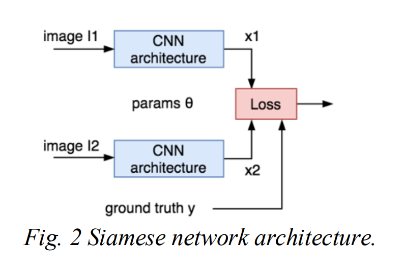
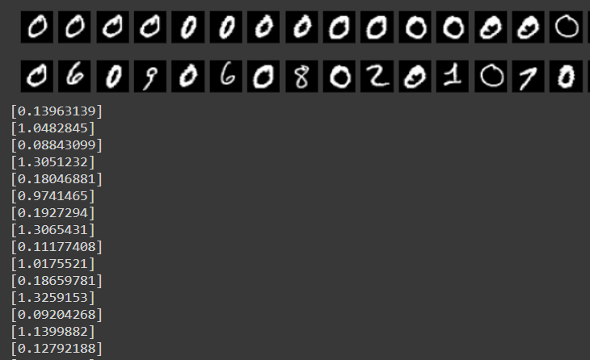

# Train a neural network to calculate the similarity between images in CIFAR, MNIST or both. 
So this task is about calculate the similarity between images. 

First, i think about the Frechet Inception Distance score(FID).

The FID is a metric that calculates the distance between feature vectors calculated for real and generated images.

The score summarizes how similar the two groups are in terms of statistics on computer vision features of the raw images calculated using the inception v3 model used for image classification. Lower scores indicate the two groups of images are more similar, or have more similar statistics, with a perfect score being 0.0 indicating that the two groups of images are identical.

The FID score is used to evaluate the quality of images generated by generative adversarial networks, and lower scores have been shown to correlate well with higher quality images.

But this method compares the raw iamges with the generated images, i don't konw if it match this task. 

---
Then I investigated on the Internet and found a way to compare the similarity of two pictures.
It's called **Siamese neural network**.

## Similarity learning
Similarity learning is an area of supervised machine learning in which the goal is to learn a similarity function that measures how similar or related two objects are and returns a similarity value. 
A higher similarity score is returned when the objects are similar and a lower similarity score is returned when the objects are different. Now let us see some use cases to know why and when similarity learning is used.

Consider a problem in which we have to train a model that can recognise all the students in a class to mark their attendance. We can use Image classification, we will collect data for all the students in the class and use them to train the model. After training the model, now we can recognise each student in the class. 

But what if we have a new student enrolled since we did not train the model on his data, it cannot recognise the new student. We will have to collect the new data and retrain the model, but training the model is expensive in terms of time and computation power. So we can pose this problem as similarity learning problem instead of a classification problem to solve this problem in an optimal way.

Now we will have a model that returns a similarity score instead of labels. So when a student enters, we can compare him with his photo and if the similarity score is higher than a certain threshold, we mark him present. 
Now if we have an unknown person who does not match any images in the data, the similarity score will be low and he won’t be marked present. Remember we don’t have to retrain the model in order to add new students, we just need his one image from which he can be compared.

Another example of similarity learning can be comparing the signature on the checks. These kinds of networks can also be used to compare the signature of the account holder to the signature on the check. If the similarity score is higher than the check is accepted and if the similarity score is low than the signature is most probably forged

## Siamese Neural Networks
A Siamese neural network (sometimes called a twin neural network) is an artificial neural network that uses the same weights while working in tandem on two different input vectors to compute comparable output vectors. Often one of the output vectors is precomputed, thus forming a baseline against which the other output vector is compared. This is similar to comparing fingerprints but can be described more technically as a distance function for locality-sensitive hashing.

Usually, we only train one of the subnetworks and use the same configuration for other sub-networks. These networks are used to find the similarity of the inputs by comparing their feature vectors.



Consider the diagram above, the very first subnetwork takes an image as input and after passing through convolutional layers and fully connected layers,we get a vector representation of the image l1. Now the second image l2 is actually the one I want to compare with the first image, so I pass this image through a network that is exactly the same with same weights and parameters.
Now that we have two encodings x1 and x2, we will compare these two to know how similar the two image are.

It is important to note that the x1 and x2 must be quite similar if both the inputs are similar which is the case in this example.And if the image are different,we want x1 and x2 to be very different.So this is how we are going to train the network.

So how do we compare vectors x1 and x2 and when can we say that they are similar or different? We simply measure the distance between these vectors and if the distance between them is small than the vectors are similar and if the distance between is larger than the vectors are very different from one another.
So we can define a distance function d, that can give us the distance between two vectors such as:
$$
d(A, B) = ||F(A)-F(B)||^2
$$
So when A and B are the same image, d(A,B) is small and when A and B are different image d(A,B) is large. So we can form a loss functions around this.When A and B are a positive pair, i.e. are of a same image we can define the loss function exactly as L2 norm between F(A) and F(B).
$$
L(A, B)=||F(A)-F(B)||^2
$$
So when A and B are the same image, d(A,B) is small and when A and B are different image d(A,B) is large. So we can form a loss functions around this.When A and B are a positive pair, i.e. are of a same person we can define the loss function exactly as L2 norm between F(A) and F(B).
$$
L(A,B)=\max(0, m^2-||F(A)-F(B)||^2)
$$
So, this value is going to be zero when F(A) and F(B) are already distant apart(>m).

Now putting both of these losses together, we get a contrastive loss given as:
$$
L(A,B)=y||F(A)-F(B)||^2+(1-y)\max(0, m^2-||F(A)-F(B)||^2)
$$
So when A and B are the same iamge, we will have a label y equal to 1 and when A and B are different,y is equal to zero.

By using contrastive loss, we bring positive pairs together and negative pairs apart. But using this loss function we cannot learn ranking which means we are not able to say how much two pairs are similar to each other, we shall see how to do this in the next section.

## Triplet loss
When using contrastive loss we were only able to differentiate between similar and different images but when we use triplet loss we can also find out which image is more similar when compared with other images. In other words, the network learns ranking when trained using triplet loss.

When using triplet loss, we no longer need positive and negative pairs of images. We need triplets of images in which we have an anchor image, a positive image that is similar to anchor image and a negative image that is very different from the anchor image as shown below:
<center>
    
    <br>
    <div style="color:orange; border-bottom: 1px solid #d9d9d9;
    display: inline-block;
    color: #999;
    padding: 2px;">Triplet loss on two positive faces (Obama) and one negative face (Macron)</div>
</center>

When computing the vectors for these images, we want the vectors of anchor image and positive image to come closer and we want to make increase the distance between anchor image and negative image.

The distance between anchor vector and the positive vector is given by:
$$
||F(A)-F(P)||^2
$$
Whereas the distance between anchor vector and the negative vector is given by:
$$
||F(A)-F(N)||^2
$$
As mentioned above, we want the anchor image and positive image to have less distance between them as compared to the distance between anchor image and negative image, therefore:
$$
||F(A)-F(P)||^2<||F(A)-F(N)||^2
$$
So we can form the loss function as following:
$$
L(A,P,N)=\max(0,||F(A)-F(P)||^2<||F(A)-F(N)||^2+m)
$$
Where m is a margin as we also saw in the hinge function of the contrastive loss. So if the positive image is already closer to the anchor than the negative image than the function returns zero and there is no loss. But when the negative image is closer to the anchor than the positive image, we are bringing a positive image closer to the anchor. Remember that we are also using a margin term m, so the anchor point and positive point are not coming very close to each other, and only the distance between anchor image and positive image is smaller as compared to the distance between anchor image and negative image up to a margin m.
When training the network, we may face a problem with choosing the triplets. We can choose triplets in which there is a lot of difference between the positive image and negative image, thus the distance between the anchor image and positive image is already quite smaller as compared to the distance between anchor image and negative image. 
For example, when the positive image of a person’s face is completely different from the negative image like they can have different hairstyles, face structure and many other factors. In this case, the network is not able to learn completely and may not be able to differentiate on the basis of more minute features such as eye shape, nose shape etc. This may cause the model to not perform correctly when we compare two faces of different persons that do not have much difference.
## How to improve similarity learning
- Loss: For now we only saw two types of loss functions,i.e contrastive loss and triplet loss. We can conclude that triplet loss is a bit superior to contrastive loss as it helps us with ranking and is also efficient and leads to better results. But we can certainly improve the performance of the network if we can find a better loss function. “Deep metric learning with angular loss” and “correcting the triplet selection biasfor triplet loss“ are some of the interesting research papers that you should consult if further interested.

- Note: Some recent researches are coming up that show that we can also use classification loss such as cross-entropy to train a Siamese network and still get accurate results.

- Sampling: We can sample the triplets from the dataset in such a way that increase the accuracy of the model. It is better to include the hard cases to your triplets as discussed in the last section.

- Ensembles: We can also use different networks and train each of them on different triplets. Usually, we perform our data into clusters first using the clustering algorithm and then learner for each cluster.

## Code and Result
### Code 
the network structure is below:
```
Siamese(
  (c1): Conv2d(1, 32, kernel_size=(3, 3), stride=(1, 1), padding=(1, 1))
  (bn1): BatchNorm2d(32, eps=1e-05, momentum=0.1, affine=True, track_running_stats=True)
  (c2): Conv2d(32, 64, kernel_size=(3, 3), stride=(1, 1), padding=(1, 1))
  (bn2): BatchNorm2d(64, eps=1e-05, momentum=0.1, affine=True, track_running_stats=True)
  (c3): Conv2d(64, 128, kernel_size=(3, 3), stride=(1, 1))
  (bn3): BatchNorm2d(128, eps=1e-05, momentum=0.1, affine=True, track_running_stats=True)
  (fc4): Linear(in_features=128, out_features=64, bias=True)
  (bn4): BatchNorm1d(64, eps=1e-05, momentum=0.1, affine=True, track_running_stats=True)
  (fc5): Linear(in_features=64, out_features=2, bias=True)
)
```
The code is below:
```
class Siamese(nn.Module):

    def __init__(self):
        super(Siamese, self).__init__()
        self.c1 = nn.Conv2d(1, 32, kernel_size=3, padding=1)
        self.bn1 = nn.BatchNorm2d(32)
        self.c2 = nn.Conv2d(32, 64, kernel_size=3, padding=1)
        self.bn2 = nn.BatchNorm2d(64)
        self.c3 = nn.Conv2d(64, 128, kernel_size=3, padding=0)
        self.bn3 = nn.BatchNorm2d(128)

        self.fc4 = nn.Linear(128, 64)
        self.bn4 = nn.BatchNorm1d(64)
        self.fc5 = nn.Linear(64, 2)

    def forward(self, x):
        h = F.max_pool2d(self.bn1(self.c1(x)), 2)
        h = F.max_pool2d(self.bn2(self.c2(h)), 2)
        h = F.avg_pool2d(self.bn3(self.c3(h)), 5)

        h = h.view(h.size(0), -1)
        h = self.bn4(self.fc4(h))
        return self.fc5(h)
```
This task i use pytorch to do a implement.
After passing through convolutional layers and fully connected layers,we get a vector representation of the image.

The loss function i use the contractive loss like below:
```
def contractive_loss(o1, o2, y):
    g, margin = F.pairwise_distance(o1, o2), 5.0
    loss = (1 - y) * (g ** 2) + y * (torch.clamp(margin - g, min=0) ** 2)
    return torch.mean(loss)
```
The test loss is below:
```
0%|          | 0/469 [00:00<?, ?it/s]Epoch	TrainLoss	TestLoss
 
1%|          | 3/469 [00:00<00:18, 24.59it/s]43	0.011131	0.012309
1%|          | 3/469 [00:00<00:19, 24.19it/s]44	0.012675	0.011227
1%|          | 3/469 [00:00<00:20, 23.26it/s]45	0.011760	0.012378
1%|          | 3/469 [00:00<00:17, 26.09it/s]46	0.011742	0.013621
1%|          | 3/469 [00:00<00:18, 25.00it/s]47	0.011939	0.011973
1%|          | 3/469 [00:00<00:20, 23.26it/s]48	0.011213	0.012027
                                             49	0.011628	0.012961
```
The reult is below:

In the above image, we have plotted some of the images from our testing set along with their predictions. Remember that we have trained our model in such a way that it predicts a similarity score closer to zero when the images are similar and a similarity score closer to 1 when the digits are different. 
Therefore for the very first example, we can see that both the images are of zero and thus are quite similar. The model has accurately given the value close to zero and when the images are quite different, the model returns the number closer to 1.
## Reference
1. Appalaraju S, Chaoji V. Image similarity using deep CNN and curriculum learning[J]. arXiv preprint arXiv:1709.08761, 2017.
2. [Siamese neural network](https://en.wikipedia.org/wiki/Siamese_neural_network)
3. Utkin L, Kovalev M, Kasimov E. An explanation method for Siamese neural networks[C]//Proceedings of International Scientific Conference on Telecommunications, Computing and Control. Springer, Singapore, 2021: 219-230.
