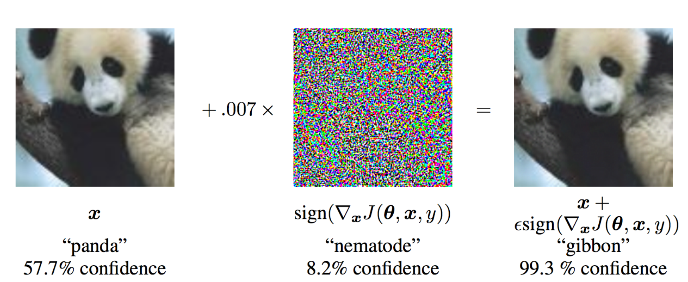
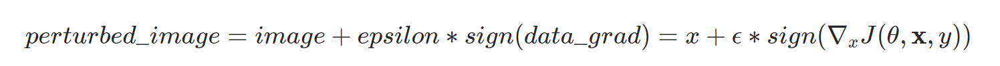
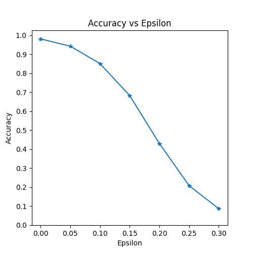
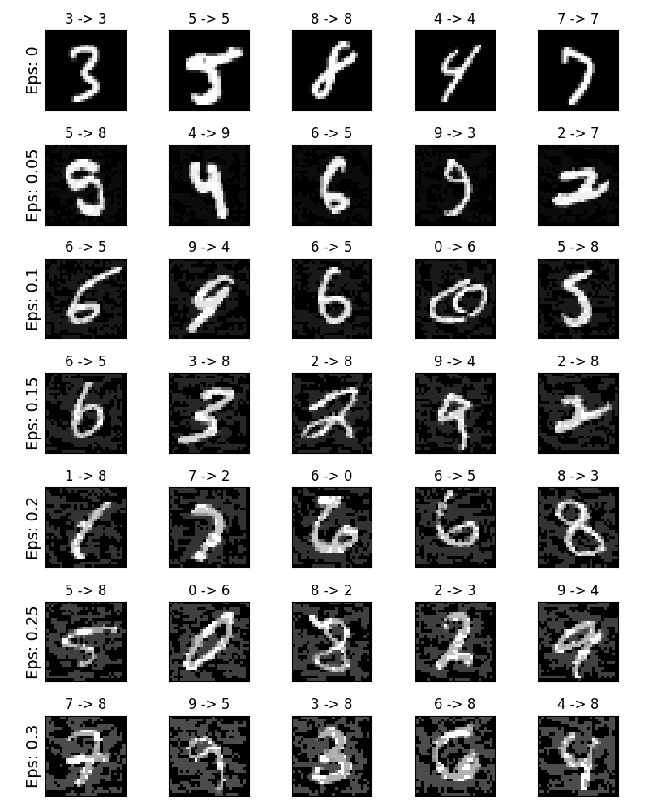

# Apply a single deep learning network to CIFAR, MNIST or both and then modify the dataset to one in which the network perform statistically worse than before. 

this task is talk about modify the datset to fool the network.
so first i think it's a image enhancement task, for example, rotate, crop, and stretch the image.
but as i konw, image enhancement is always used when the dataset is insufficient, and to increase the richness of the dataset when training the network.

I think the use of image enhancement should not meet the requirements of this task.
Then I searched the Internet for content related to image fooling, and i first have a look at [2], use pytorch to implement Fooling Images (add specific noise to the original image to make the neural network misrecognize)

I think this should be a bit close to the task, but there are still some strange things. At this time I learned about a technology called adversarial attack.  
so the Adversarial attack is a machine learning technique that attempts to fool models by supplying deceptive input.

I think this fits the task, but i have never been exposed to this technology, I did a lot of searches.  

## Threat Model
For context, there are many categories of adversarial attacks, each with a different goal and assumption of the attacker’s knowledge. However, in general the overarching goal is to add the least amount of perturbation to the input data to cause the desired misclassification. 
There are several kinds of assumptions of the attacker’s knowledge, two of which are: white-box and black-box. A white-box attack assumes the attacker has full knowledge and access to the model, including architecture, inputs, outputs, and weights. 
A black-box attack assumes the attacker only has access to the inputs and outputs of the model, and knows nothing about the underlying architecture or weights. 
Both of these attack categories have the general goal of fooling a neural network into making wrong predictions. They do it by adding hard-to-notice noise to the input of the network. 
What makes these two types of attacks different is your ability to gain access to the entire architecture of the model. With white box attacks, you have complete access to the architecture (weights), and the input and output of the model. 
Control over the model is lower with black box attacks, as you only have access to the input and output of the model. 
There are also several types of goals, including misclassification and source/target misclassification. A goal of misclassification means the adversary only wants the output classification to be wrong but does not care what the new classification is. A source/target misclassification means the adversary wants to alter an image that is originally of a specific source class so that it is classified as a specific target class.

The Fast Gradient Sign Method (FGSM) combines a white box approach with a misclassification goal. It tricks a neural network model into making wrong predictions.
In this case, the FGSM attack is a white-box attack with the goal of misclassification. With this background information, we can now discuss the attack in detail.

## Fast Gradient Sign Attack
One of the first and most popular adversarial attacks to date is referred to as the Fast Gradient Sign Attack (FGSM) and is described by Goodfellow et. al. in [1]. 
The name makes it seem like a difficult thing to understand, but the FGSM attack is incredibly simple. It involves three steps in this order:
1. Calculate the loss after forward propagation,
2. Calculate the gradient with respect to the pixels of the image.
3. Nudge the pixels of the image ever so slightly in the direction of the calculated gradients that maximize the loss calculated above.

Adversarial examples are specialised inputs created with the purpose of confusing a neural network, resulting in the misclassification of a given input. These notorious inputs are indistinguishable to the human eye, but cause the network to fail to identify the contents of the image. There are several types of such attacks, however, here the focus is on the fast gradient sign method attack, which is a white box attack whose goal is to ensure misclassification. A white box attack is where the attacker has complete access to the model being attacked. 
The attack is remarkably powerful, and yet intuitive. It is designed to attack neural networks by leveraging the way they learn, gradients. The idea is simple, rather than working to minimize the loss by adjusting the weights based on the backpropagated gradients, the attack adjusts the input data to maximize the loss based on the same backpropagated gradients. In other words, the attack uses the gradient of the loss w.r.t the input data, then adjusts the input data to maximize the loss.

What is not common, is the calculation of the gradients with respect to the pixels of the image. When it comes to training neural networks, gradients are how you determine the direction in which to nudge your weights to reduce the loss value. 
Instead of doing that, here we adjust the input image pixels in the direction of the gradients to maximize the loss value.



so in a word, from the figure, $\mathbf{x}$ is the original input image correctly classified as a “panda”, $y$ is the ground truth label for $\mathbf{x}$, $\mathbf{\theta}$ represents the model parameters, and $J(\mathbf{\theta}, \mathbf{x}, y)$ is the loss that is used to train the network. 

The attack backpropagates the gradient back to the input data to calculate $\nabla_{x} J(\mathbf{\theta}, \mathbf{x}, y)$.

Then, it adjusts the input data by a small step ($\epsilon$ or 0.007 in the picture) in the direction (i.e. $sign(\nabla_{x} J(\mathbf{\theta}, \mathbf{x}, y))$ that will maximize the loss. 

The resulting perturbed image, $x'$, is then misclassified by the target network as a “gibbon” when it is still learly a “panda”.

## Model
The Net definition and test dataloader here is a simple MNIST example. The purpose of this section is to define the model and dataloader, then initialize the model and load the pretrained weights.
```
# LeNet Model definition
class Net(nn.Module):
    def __init__(self):
        super(Net, self).__init__()
        self.conv1 = nn.Conv2d(1, 10, kernel_size=5)
        self.conv2 = nn.Conv2d(10, 20, kernel_size=5)
        self.conv2_drop = nn.Dropout2d()
        self.fc1 = nn.Linear(320, 50)
        self.fc2 = nn.Linear(50, 10)

    def forward(self, x):
        x = F.relu(F.max_pool2d(self.conv1(x), 2))
        x = F.relu(F.max_pool2d(self.conv2_drop(self.conv2(x)), 2))
        x = x.view(-1, 320)
        x = F.relu(self.fc1(x))
        x = F.dropout(x, training=self.training)
        x = self.fc2(x)
        return F.log_softmax(x, dim=1)

# MNIST Test dataset and dataloader declaration
test_loader = torch.utils.data.DataLoader(
    datasets.MNIST('../data', train=False, download=True, transform=transforms.Compose([
            transforms.ToTensor(),
            ])),
        batch_size=1, shuffle=True)

# Define what device we are using
print("CUDA Available: ",torch.cuda.is_available())
device = torch.device("cuda" if (use_cuda and torch.cuda.is_available()) else "cpu")

# Initialize the network
model = Net().to(device)

# Load the pretrained model
model.load_state_dict(torch.load(pretrained_model, map_location='cpu'))

# Set the model in evaluation mode. In this case this is for the Dropout layers
model.eval()
```
## FGSM Attack
They define the function that creates the adversarial examples by perturbing the original inputs. The fgsm_attack function takes three inputs, 

- image is the original clean image (x),   
- epsilon is the pixel-wise perturbation amount ($\epsilon$),   
- data_grad is gradient of the loss w.r.t the input image ($\nabla_{x} J(\mathbf{\theta}, \mathbf{x}, y))$. 

The function then creates perturbed image as:

Finally, in order to maintain the original range of the data, the perturbed image is clipped to range [0,1].
```
# FGSM attack code
def fgsm_attack(image, epsilon, data_grad):
    # Collect the element-wise sign of the data gradient
    sign_data_grad = data_grad.sign()
    # Create the perturbed image by adjusting each pixel of the input image
    perturbed_image = image + epsilon*sign_data_grad
    # Adding clipping to maintain [0,1] range
    perturbed_image = torch.clamp(perturbed_image, 0, 1)
    # Return the perturbed image
    return perturbed_image
```
## Run Attack
And then is to actually run the attack. Here, we run a full test step for each epsilon value in the epsilons input. For each epsilon we also save the final accuracy and some successful adversarial examples to be plotted in the coming sections. Notice how the printed accuracies decrease as the epsilon value increases. Also, note the $\epsilon=0$ case represents the original test accuracy, with no attack.
The result is below:
```
Epsilon: 0      Test Accuracy = 9810 / 10000 = 0.981
Epsilon: 0.05   Test Accuracy = 9426 / 10000 = 0.9426
Epsilon: 0.1    Test Accuracy = 8510 / 10000 = 0.851
Epsilon: 0.15   Test Accuracy = 6826 / 10000 = 0.6826
Epsilon: 0.2    Test Accuracy = 4301 / 10000 = 0.4301
Epsilon: 0.25   Test Accuracy = 2082 / 10000 = 0.2082
Epsilon: 0.3    Test Accuracy = 869 / 10000 = 0.0869
```
## Results 
The first result is the accuracy versus epsilon plot. 
As alluded to earlier, as epsilon increases we expect the test accuracy to decrease. This is because larger epsilons mean we take a larger step in the direction that will maximize the loss. Notice the trend in the curve is not linear even though the epsilon values are linearly spaced. 
For example, the accuracy at $\epsilon=0.05$ is only about 4% lower than $\epsilon=0$, but the accuracy at $\epsilon=0.2$ is 25% lower than $\epsilon=0.15$. Also, notice the accuracy of the model hits random accuracy for a 10-class classifier between $\epsilon=0.25$ and $\epsilon=0.3$.


### Sample Adversarial Examples
In this case, as epsilon increases the test accuracy decreases BUT the perturbations become more easily perceptible. In reality, there is a tradeoff between accuracy degredation and perceptibility that an attacker must consider. Here, we show some examples of successful adversarial examples at each epsilon value. Each row of the plot shows a different epsilon value. 
The first row is the $\epsilon=0$ examples which represent the original “clean” images with no perturbation. The title of each image shows the “original classification -> adversarial classification.” Notice, the perturbations start to become evident at $\epsilon=0.15$ and are quite evident at $\epsilon=0.3$.
However, in all cases humans are still capable of identifying the correct class despite the added noise.

## Reference 
1. Goodfellow I J, Shlens J, Szegedy C. Explaining and harnessing adversarial examples[J]. arXiv preprint arXiv:1412.6572, 2014.
2. [ADVERSARIAL EXAMPLE GENERATION](https://pytorch.org/tutorials/beginner/fgsm_tutorial.html#fast-gradient-sign-attack)
3. [Use pytorch to implement Fooling Images](https://www.programmersought.com/article/40155926731/)
