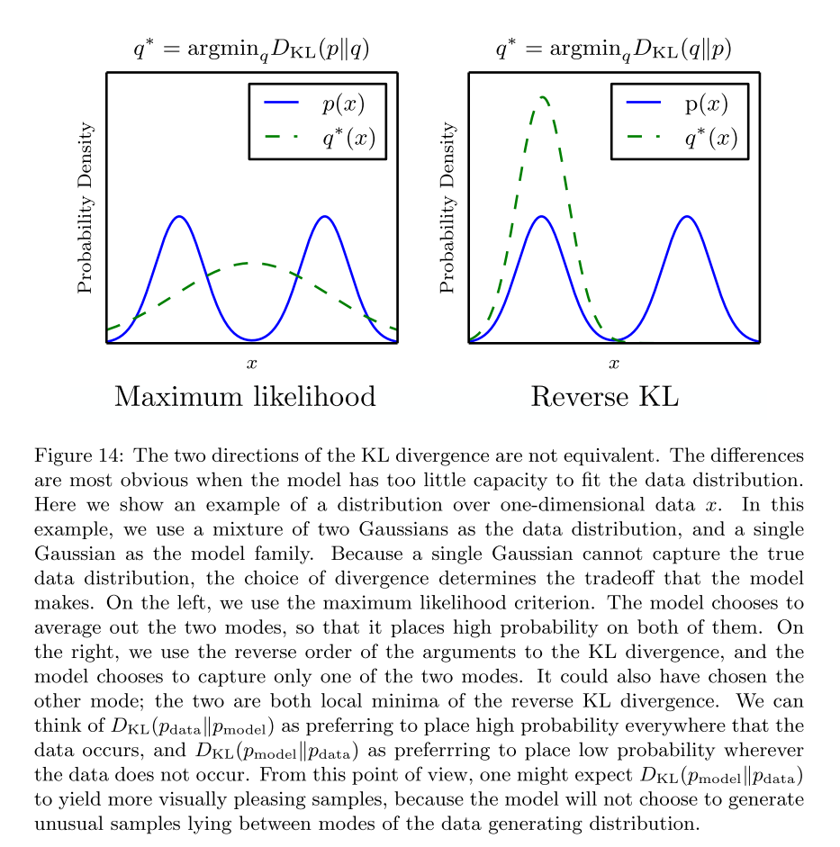

# Choose an artificial intelligent system to discuss/analyze from a math/probabilistic point of view.

So in this task, i want to have a discuss from a math point of GANs.

Generative Adversarial Networks refer to a family of generative models that seek to discover the underlying distribution behind a certain data generating process. This distribution is discovered through an adversarial competition between a generator and a discriminator. The two models are trained such that the discriminator strives to distinguish between generated and true examples, while the generator seeks to confuse the discriminator by producing data that are as realistic and compelling as possible.

## Generative modeling
Suppose that we are interested in generating black and white square images of dogs with a size of n by n pixels. We can reshape each data as a $N=nxn$ dimensional vector (by stacking columns on top of each others) such that an image of dog can then be represented by a vector. However, it doesn’t mean that all vectors represent a dog once shaped back to a square! So, we can say that the N dimensional vectors that effectively give something that look like a dog are distributed according to a very specific probability distribution over the entire N dimensional vector space (some points of that space are very likely to represent dogs whereas it is highly unlikely for some others). In the same spirit, there exists, over this N dimensional vector space, probability distributions for images of cats, birds and so on.

Then, the problem of generating a new image of dog is equivalent to the problem of generating a new vector following the “dog probability distribution” over the N dimensional vector space. So we are, in fact, facing a problem of generating a random variable with respect to a specific probability distribution.

At this point, we can mention two important things. First the “dog probability distribution” we mentioned is a very complex distribution over a very large space. Second, even if we can assume the existence of such underlying distribution (there actually exists images that looks like dog and others that doesn’t) we obviously don’t know how to express explicitly this distribution. Both previous points make the process of generating random variables from this distribution pretty difficult. Let’s then try to tackle these two problems in the following.

So let’s use transform method with a neural network as function.
Our first problem when trying to generate our new image of dog is that the “dog probability distribution” over the N dimensional vector space is a very complex one and we don’t know how to directly generate complex random variables. However, as we know pretty well how to generate N uncorrelated uniform random variables, we could make use of the transform method. To do so, we need to express our N dimensional random variable as the result of a very complex function applied to a simple N dimensional random variable!

Here, we can emphasise the fact that finding the transform function is not as straightforward as just taking the closed-form inverse of the Cumulative Distribution Function (that we obviously don’t know) as we have done when describing the inverse transform method. The transform function can’t be explicitly expressed and, then, we have to learn it from data.

As most of the time in these cases, very complex function naturally implies neural network modelling. Then, the idea is to model the transform function by a neural network that takes as input a simple N dimensional uniform random variable and that returns as output another N dimensional random variable that should follow, after training, the the right “dog probability distribution”. Once the architecture of the network has been designed, we still need to train it. 
In the next sections, we will discuss to train the generative networks, including the idea of adversarial training behind GANs!

## Maximum likelihood estimation
To simplify the discussion somewhat, we will focus on generative models that work via the principle of maximum likelihood. Not every generative model uses maximum likelihood. Some generative models do not use maximum likeli-hood by default, but can be made to do so (GANs fall into this category). By ignoring those models that do not use maximum likelihood, and by focusing on the maximum likelihood version of models that do not usually use maximum likelihood, we can eliminate some of the more distracting differences between different models.
The basic idea of maximum likelihood is to define a model that provides an
estimate of a probability distribution, parameterized by parameters θ. We then refer to the likelihood as the probability that the model assigns to the training data:
$$\prod^m_{i=1}p_model(x^{(i)};\theta)$$
for a dataset containing m training examples $x(i)$.
The principle of maximum likelihood simply says to choose the parameters
for the model that maximize the likelihood of the training data. This is easiest to do in log space, where we have a sum rather than a product over examples. This sum simplifies the algebraic expressions for the derivatives of the likelihood with respect to the models, and when implemented on a digital computer, is less prone to numerical problems, such as underflow resulting from multiplying together several very small probabilities.
$$
\begin{aligned}
\theta^*&=\argmax_{\theta}\prod^m_{i=1}p_{model}(x^{(i)};\theta)\\
&=\argmax_\theta\log\prod^m_{i=1}p_{model}(x^{(i)};\theta)\\ \tag{2}
&=\argmax_\theta\sum^m_{i=1}\log p_{model}(x^{(1)};\theta)\\
\end{aligned}
$$
In equation 2, we have used the property that $arg max_v f(v) = arg max_v log f(v)$
for positive $v$, because the logarithm is a function that increases everywhere and does not change the location of the maximum.

We can also think of maximum likelihood estimation as minimizing the KL divergence between the data generating distribution and the model:
$$
\theta^*=\argmin_\theta D_{kl}(p_{data}(x)||p_{model}(x;\theta))
$$
If we were able to do this precisely, then if $p_{data}$ lies within the family of distributions $p_{model}(x; θ)$, the model would recover $p_{data}$ exactly. In practice, we do not have access to pdata itself, but only to a training set consisting of m samples from $p_{data}$. We uses these to define $\widehat{p}_{data}$, an empirical distribution that places mass only on exactly those m points, approximating pdata. Minimizing the KL divergence between $\widehat{p}_{data}$ and $p_{model}$ is exactly equivalent to maximizing the log-likelihood of the training set.

## Generative Adversarial Networks
In other words,
**Discriminator**: The role is to distinguish between actual and generated (fake) data.
**Generator**: The role is to create data in such a way that it can fool the discriminator.

## The Discriminator 
The goal of the discriminator is to correctly label generated images as false and empirical data points as true.  
Therefore, we might consider the following to be the loss function of the discriminator:

$L_D=Error(D(x),1)+Error(D(G(z)),0)$

Here, we are using a very generic, unspecific notation for Error to refer to some function that tells us the distance or the difference between the two functional parameters. 
So always use Binary Cross Entropy loss to caluate the error, and will introduce in the next part.

## The Generator 
We can go ahead and do the same for the generator. The goal of the generator is to confuse the discriminator as much as possible such that it mislabels generated images as being true.

$L_G=Error(D(G(z)),1)$

The key here is to remember that a loss function is something that we wish to minimize. In the case of the generator, it should strive to minimize the difference between 1, the label for true data, and the discriminator’s evaluation of the generated fake data.

## Binary Cross Entropy
The loss function described in the original paper [2]. can be derived from the formula of binary cross-entropy loss. 
A common loss function that is used in binary classification problems is binary cross entropy. As a quick review, let’s remind ourselves of what the formula for cross entropy looks like:

$H(p,q)=E_{x∼p(x)}[−logq(x)]$

In classification tasks, the random variable is discrete. Hence, the expectation can be expressed as a summation.

$H(p,q)=−∑_{x\in\chi}p(x)logq(x)$

We can simplify this expression even further in the case of binary cross entropy, since there are only two labels: zero and one.

$H(y,\widehat{y})=−\sum ylog(\widehat{y})+(1−y)log(1−\widehat{y})$

This is the Error function that we have been loosely using in the sections above.  

Binary cross entropy fulfills our objective in that it measures how different two distributions are in the context of binary classification of determining whether an input data point is true or false.
Applying this to the loss functions in the first formulae,

$L_D=−∑_{x\in\chi,z\in\zeta}log(D(x))+log(1−D(G(z)))$

And do the same for the second formulae, 

$L_G=−∑_{z\in\zeta}log(D(G(z))$

Now we have two loss functions with which to train the generator and the discriminator.  
Note that, for the loss function of the generator, the loss is small if $D(G(z))$ is close to 1, since log(1)=0.  
This is exactly the sort of behavior we want from a loss function for the generator. 

## Model Optimization
Now that we have defined the loss functions for the generator and the discriminator.
it’s time to discuss some math to solve the optimization problem, i.e. finding the parameters for the generator and the discriminator such that the loss functions are optimized.  

### Training the Discriminator
When training a GAN, we typically train one model at a time. In other words, when training the discriminator, the generator is assumed as fixed.  

Let’s return back to the min-max game. The quantity of interest can be defined as a function of G and D.  
Let’s call this the value function:

$V(G,D)=\Epsilon_{x∼p_{data}}[log(D(x))]+\Epsilon_{z∼p_z}[log(1−D(G(z)))]$

In reality, we are more interested in the distribution modeled by the generator than $p_z$. Therefore, let’s create a new variable, $y=G(z)$, and use this substitution to rewrite the value function:

$$
\begin{aligned}
V(G,D)&=\Epsilon_{x∼p_{data}}[log(D(x))]+\Epsilon_{y∼p_g}[log(1−D(y))]\\ 
&=\int_{x\in\chi}p_{data}(x)log(D(x))+p_g(x)log(1−D(x))dx
\end{aligned}
$$

The goal of the discriminator is to maximize this value function. 
Through a partial derivative of $V(G,D)$ with respect to $D(x)$, we see that the optimal discriminator, denoted as $D∗(x)$, occurs when

$ \frac{p_{data}(x)}{D(x)} − \frac{p_g(x)}{1−D(x)} =0$

rearranging, and get

$D∗(x)= \frac{p_{data}(x)}{p_{data}(x) + p_g(x)}$

And this is the condition for the optimal discriminator.
Note that the formula makes intuitive sense: if some sample x is highly genuine, we would expect $p_{data}(x)$ to be close to one and $p_g(x)$ to be converge to zero, in which case the optimal discriminator would assign 1 to that sample. 
On the other hand, for a generated sample x=G(z), we expect the optimal discriminator to assign a label of zero, since $p_{data}(G(z))$ should be close to zero.

### Training the Generator
To train the generator, i assume the discriminator to be fixed and proceed with the analysis of the value function. Let’s first plug in the result i found above, namely $D^*$, into the value function to see what turns out.

$$
\begin{aligned}
V(G,D^∗)&=\Epsilon_{x∼p_{data}}[log(D^∗(x))]+\Epsilon_{x∼p_g}[log(1−D^∗(x))] \\
&=\Epsilon_{x∼p_{data}}[\log\frac{p_{data}(x)}{p_{data}(x)+p_g(x)}]+\Epsilon_{x∼p_g}[\log\frac{p_g(x)}{p_{data}(x)+p_g(x)}]\\
\end{aligned}
$$

and then, 

$$
\begin{aligned}
    V(G,D^∗)&=\Epsilon_{x∼p_{data}}[\log\frac{p_{data}(x)}{p_{data}(x)+p_g(x)}]+\Epsilon_{x∼p_g}[\log\frac{p_g(x)}{p_{data}(x)+p_g(x)}]\\
    &=−log4+\Epsilon_{x∼p_{data}}[\log p_{data}(x)−\log\frac{p_{data}(x)+p_g(x)}{2}]\\ 
    + &\Epsilon_{x∼p_g}[\log p_g(x)−\log\frac{p_{data}(x)+p_g(x)}{2}]
\end{aligned}
$$

For this, what we want to do is that we are exploiting the properties of logarithms to pull out a −log4 that previously did not exist. In pulling out this number, we inevitably apply changes to the terms in the expectation, specifically by dividing the denominator by two.

And then, we can now interpret the expectations as Kullback-Leibler divergence:

$V(G,D^∗)=−\log4+D_{KL}(p_{data}||\frac{p_{data}+p_g}{2})+D_{KL}(p_g||\frac{p_{data}+p_g}{2})$

And it is here that we reencounter the Jensen-Shannon divergence, which is defined as:

$J(P,Q)=\frac{1}{2}(D(P||R)+D(Q||R))$

where $R=\frac{1}{2}(P+Q)$.
This means that the expression in $V(G,D^*)$ can be expressed as a JS divergence:

$V(G,D^∗)=−\log4+2⋅D_{JS}(p_{data}||p_g)$

The conclusion of this analysis is simple: 
the goal of training the generator, which is to minimize the value function V(G,D), we want the JS divergence between the distribution of the data and the distribution of generated examples to be as small as possible. 

This conclusion certainly aligns with our intuition: 
we want the generator to be able to learn the underlying distribution of the data from sampled training examples. In other words, $p_g$ and $p_{data}$ should be as close to each other as possible. The optimal generator G is thus one that which is able to mimic $p_{data}$ to model a compelling model distribution $p_g$.

## About Jensen–Shannon divergence
In probability theory and statistics, the Jensen–Shannon divergence is a method of measuring the similarity between two probability distributions. 
It is also known as information radius (IRad) or total divergence to the average. It is based on the Kullback–Leibler divergence, with some notable (and useful) differences, including that it is symmetric and it always has a finite value. The square root of the Jensen–Shannon divergence is a metric often referred to as Jensen-Shannon distance.

Previously, many people (including the author) believed that GANs produced sharp, realistic samples because they minimize the Jensen-Shannon di- vergence while VAEs produce blurry samples because they minimize the KL divergence between the data and the model.
The KL divergence is not symmetric; minimizing $D_{KL}(p_{data}||p_{model})$ is different from minimizing $D_{KL}(p_{model}||p_{data})$. Maximum likelihood estimation perfer to generate samples that come only from modes in the training distribution even if that means ignoring some modes, rather than including all modes but generating some samples that do not come from any training set mode. 

## Reference 
1. Wang Y. A Mathematical Introduction to Generative Adversarial Nets (GAN)[J]. arXiv preprint arXiv:2009.00169, 2020.
2. Goodfellow I J, Pouget-Abadie J, Mirza M, et al. Generative adversarial networks[J]. arXiv preprint arXiv:1406.2661, 2014.
3. Goodfellow I. Nips 2016 tutorial: Generative adversarial networks[J]. arXiv preprint arXiv:1701.00160, 2016.
4. [The Math Behind GANs](https://jaketae.github.io/study/gan-math/)
5. [Jensen–Shannon divergence](https://en.wikipedia.org/wiki/Jensen%E2%80%93Shannon_divergence)