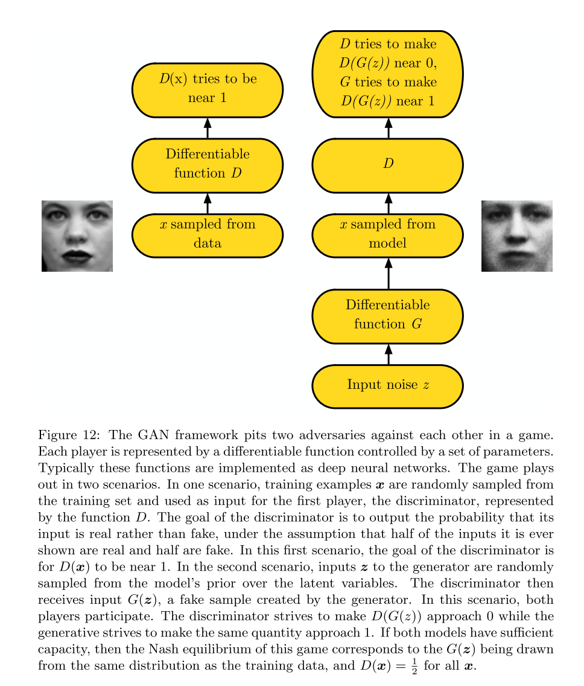

# Use chaos theory, dynamical systems or game theory to analyze an artificial intelligent system.
In this task, i want to use game theory to analyze an artificial intelligent system. 

Game theory is the study of mathematical models of strategic interaction among rational decision-makers.
It has applications in all fields of social science, as well as in logic, systems science and computer science. Originally, it addressed zero-sum games, in which each participant's gains or losses are exactly balanced by those of the other participants. 

Game Theory is a branch of mathematics used to model the strategic interaction between different players in a context with predefined rules and outcomes.

Game Theory can be applied in different ambit of Artificial Intelligence:
- Multi-agent AI systems.
- Imitation and Reinforcement Learning.
- Adversary training in Generative Adversarial Networks (GANs).

Because I have relatively little knowledge of Multi-agent AI systems and RL, I just did some research and then introduced them. 

This time, I want to focus on the game theory used in the GANs.

## Nash Equilibrium
Nash equilibrium is a concept within game theory where the optimal outcome of a game is where there is no incentive to deviate from the initial strategy. More specifically, the Nash equilibrium is a concept of game theory where the optimal outcome of a game is one where no player has an incentive to deviate from their chosen strategy after considering an opponent's choice.

Overall, an individual can receive no incremental benefit from changing actions, assuming other players remain constant in their strategies. A game may have multiple Nash equilibria or none at all.

Nash equilibrium is named after its inventor, John Nash, an American mathematician. It is considered one of the most important concepts of game theory, which attempts to determine mathematically and logically the actions that participants of a game should take to secure the best outcomes for themselves.

The reason why Nash equilibrium is considered such an important concept of game theory relates to its applicability. The Nash equilibrium can be incorporated into a wide range of disciplines, from economics to the social sciences.

To quickly find the Nash equilibrium or see if it even exists, reveal each player's strategy to the other players. If no one changes their strategy, then the Nash equilibrium is proven.

For example, a Classification algorithm such as SVM (Support Vector Machines) can be explained in terms of a two-player game in which one player is challenging the other to find the best hyper-plane giving him the most difficult points to classify. The game will then converge to a solution which will be a trade-off between the strategic abilities of the two players (eg. how well the fist player was challenging the second one to classify difficult data points and how good was the second player to identify the best decision boundary).

The Nash Equilibrium is a condition in which all the players involved in the game agree that there is no best solution to the game than the actual situation they are in at this point. None of the players would have an advantage in changing their current strategy (based on the decisions made by the other players).

An example of Nash Equilibrium can be when the SVM classifier agrees on which hyper-plane to use classify our data.
One of the most common examples used to explain Nash Equilibrium is the **Prisoner’s Dilemma**. Let’s imagine two criminals get arrested and they are held in confinement without having any possibility to communicate with each other.
- If any of the two prisoners will confess the other committed a crime, the first one will be set free while the other will spend 10 years in prison.
- If neither of them confesses they spend just one year in prison for each.
- If they both confess, they instead both spend 5 years in prison.
In this case, the Nash Equilibrium is reached when both criminals betray each other.

Imagine a game between Tom and Sam. In this simple game, both players can choose strategy A, to receive $1, or strategy B, to lose $1. Logically, both players choose strategy A and receive a payoff of $1.
If you revealed Sam's strategy to Tom and vice versa, you see that no player deviates from the original choice. Knowing the other player's move means little and doesn't change either player's behavior. Outcome A represents a Nash equilibrium.
:max_bytes(150000):strip_icc():format(webp)/NashEquilibrium2-cbc58a27a37a4aab9585c3fc87938509.png)
## The GAN framework
The basic idea of GANs is to set up a game between two players. One of them is called the generator. The generator creates samples that are intended to come from the same distribution as the training data. The other player is the dis- criminator. The discriminator examines samples to determine whether they are real or fake. The discriminator learns using traditional supervised learning techniques, dividing inputs into two classes (real or fake). The generator is trained to fool the discriminator. We can think of the generator as being like a counterfeiter, trying to make fake money, and the discriminator as being like police, trying to allow legitimate money and catch counterfeit money. To succeed in this game, the counterfeiter must learn to make money that is indistinguishable from genuine money, and the generator network must learn to create samples that are drawn from the same distribution as the training data. 

The two players in the game are represented by two functions, each of which
is differentiable both with respect to its inputs and with respect to its parameters. The discriminator is a function D that takes x as input and uses $θ^{(D)}$ as parameters. The generator is defined by a function G that takes z as input and uses $θ^{(G)}$ as parameters. 
Both players have cost functions that are defined in terms of both players’ parameters. The discriminator wishes to minimize $J^{(D)}(θ(D), θ(G))$
and must do so while controlling only θ(G). Because each
player’s cost depends on the other player’s parameters, but each player cannot
control the other player’s parameters, this scenario is most straightforward to describe as a game rather than as an optimization problem. The solution to an optimization problem is a (local) minimum, a point in parameter space where all neighboring points have greater or equal cost. The solution to a game is a Nash equilibrium. 
Here, we use the terminology of local differential Nash equilibria. In this context, a Nash equilibrium is a tuple $(θ^{(D)}, θ^{(G)})$ that is a local minimum of $J^{(D)}$ with respect to $θ^{(D)}$ and a local minimum of $J^{(G)}$ with respect to $θ^{(G)}$ and a local minimum of $J^{(G)}$ with respect to $θ^{(G)}$.

## Adversary training in Generative Adversarial Networks (GANs)
GANs consists of two different models: a generative model and a discriminative model.

Generative models take as input some features, examine their distributions and try to understand how they have been produced. 
Discriminative Models instead take the input features to predict to which class our sample might belong. 

In GANs, the generative model uses the input features to create new samples which aim to resemble quite closely the main characteristics of the original samples. The newly generated samples are then passed with the original ones to the discriminative model which has to recognise which samples are genuine and which ones are fake.
An example application of GANs can be to generate images and then distinguish between real and fake ones.

This process resembles quite closely the dynamics of a game. In this game, our players (the two models) are challenging each other. The first one creates fake samples to confuse the other, while the second player tries to get better and better at identifying the right samples.
This game is then repeated iteratively and in each iteration, the learning parameters are updated in order to reduce the overall loss.
This process will keep going on until Nash Equilibrium is reached (the two models become proficient at performing their tasks and they are not able to improve anymore).

Because the GAN framework can naturally be analyzed with the tools of game theory, we call GANs “adversarial.” 
But we can also think of them as cooperative, in the sense that the discriminator estimates this ratio of densities and then freely shares this information with the generator. 
From this point of view, the discriminator is more like a teacher instructing the generator in how to improve than an adversary. So far, this cooperative view has not led to any particular change in the development of the mathematics.
## Reference
1. [Game Theory in Artificial Intelligence](https://towardsdatascience.com/game-theory-in-artificial-intelligence-57a7937e1b88)
2. [Game theory(wikipad)](https://en.wikipedia.org/wiki/Game_theory)
3. Goodfellow I. Nips 2016 tutorial: Generative adversarial networks[J]. arXiv preprint arXiv:1701.00160, 2016.